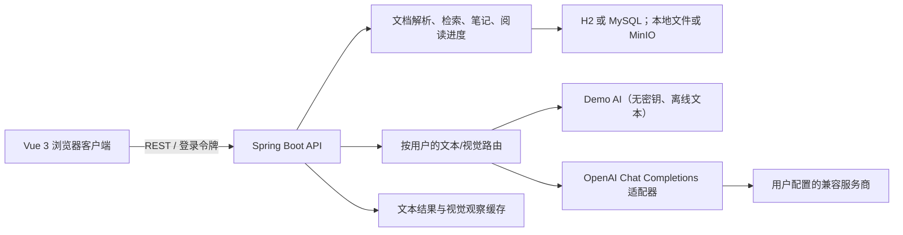

# SmartDoc：AI 学习文档助手

SmartDoc 用于阅读、整理和理解学习资料：上传 PDF、Markdown、TXT 或常见代码文件后，可检索内容、记录笔记，并在本地 Demo AI 或用户配置的兼容服务商之间完成文本与视觉任务。

## 最快启动（H2，无 Docker、无 API Key）

前置条件：Java 11、Maven 3.6+、Node.js 18+ 和 pnpm。

```powershell
cd backend
mvn spring-boot:run

# 新开终端
cd frontend
pnpm install --frozen-lockfile
pnpm dev
```

访问 `http://localhost:3000`，使用 Demo 账号登录：

```text
demo / smartdoc123
```

默认 local profile 使用 H2 和本地文件存储。未配置默认文本服务商时，Demo AI 会在本地生成确定性的文本结果，不联网、不需要 API Key；视觉识别则需要配置视觉服务商。

## Docker、MySQL 与 MinIO

Docker Compose 适用于 MySQL 8 和 MinIO：

```powershell
Copy-Item .env.example .env
# 将 .env 中所有 <...> 占位符替换为强随机值；不要加入任何 AI 服务商密钥。
docker compose up --build
```

- Web：`http://localhost:3000`
- API：`http://localhost:8080`
- MinIO 控制台：`http://localhost:9001`

新 MySQL 数据库会由 Compose 挂载的 [`scripts/init_mysql.sql`](scripts/init_mysql.sql) 初始化。已有数据库不会自动迁移，也不要让应用自动执行增量脚本。

⚠️ MySQL 增量脚本已生成到 `scripts/alter_ai_provider_config.sql`；仅旧数据库需要手动执行，新数据库使用 `scripts/init_mysql.sql`。

## 国内服务商与自定义兼容服务

“设置 → AI 服务商”提供 DeepSeek、阿里云百炼（Qwen）、火山方舟、智谱、腾讯混元、百度千帆和硅基流动的基础 URL 预设，也可新增自定义兼容服务。分别选择默认文本和默认视觉模型后，阅读器会将文本与视觉任务路由到相应服务商。

详细字段示例、路由方式和安全限制见 [服务商配置说明](docs/provider-configuration.md)。请在服务商控制台确认模型名、可用性、区域、价格和配额。

SmartDoc supports services implementing the OpenAI Chat Completions request/response shape used here; presets do not guarantee every model or vendor extension.

这表示 SmartDoc 只使用本项目所需的 Chat Completions 文本请求和 `image_url` 视觉请求；它不支持或承诺所有 OpenAI API、原生 Gemini/Anthropic/DashScope 协议、流式输出、工具调用、音频、视频或其他厂商扩展。

## 功能

- 文档库：PDF、Markdown、TXT 和常见代码文件上传、异步解析、全文检索、目录/标签、收藏与最近阅读。
- 阅读器：PDF 页码、文本/代码渲染、阅读进度、文档内搜索、笔记和 Markdown 导出。
- 文本 AI：文档/当前页总结、基于文档证据的问答、选区解释、代码解释、逐行说明、复杂度分析、问题排查、示例和面试题；结果可缓存，必要时可强制重新生成。
- 视觉 AI：对当前 PDF 页或粘贴/选择的 PNG、JPEG 图片进行识别；视觉深度分析会将结构化视觉观察交给独立的文本模型。
- 多服务商：每位用户可单独新增、测试、启用和删除服务商，并为文本与视觉任务配置不同的默认路由、每日调用上限和最大输出 token。

## 架构与数据流



文本任务在没有默认文本服务商时回退到 Demo AI；视觉任务要求已配置的视觉服务商。视觉深度分析先由视觉模型产生结构化观察，再由默认文本模型分析，因此两者可以不同。

## 安全模型

- 除登录外的 API 请求使用访问令牌；文档、笔记、服务商和路由均按当前用户授权。
- 服务商密钥仅提交给后端，提交后会从浏览器输入框清除，不进入浏览器存储、URL 或常规读取响应；页面只显示是否已配置和掩码状态。
- 后端可安全持久化密钥时才会加密保存；否则仅保存在服务进程内存，重启后需重新录入。
- 服务商 URL 默认仅允许 HTTPS，并限制环回/私有网络地址；请只在受控开发环境中显式放开相关开关。
- 每日配额、最大输出 token、用户范围的缓存和对服务商错误的安全映射共同限制调用风险。
- `.env`、H2 数据、上传文件、MinIO/MySQL 数据卷、构建产物和依赖目录均已忽略；CI 不注入或请求 AI 密钥。

## 截图

本仓库目前不包含可验证的本地运行截图，因此 README 不引用图片文件。发布前如需补充，请在 Demo 或 mock-provider 环境中重新截取“AI 服务商设置”和“阅读器视觉识别”界面，并确认画面没有密钥、令牌、真实用户名、本机路径或浏览器扩展信息。

## 测试与构建

```powershell
cd backend
mvn test

cd ../frontend
pnpm install --frozen-lockfile
pnpm test
pnpm build
```

GitHub Actions 在 push 和 pull request 上分别运行后端 Maven 测试、前端 Vitest 与生产构建；独立的密钥扫描工作流会拒绝常见明文 API Key、Bearer Token 和主密钥赋值。

## 项目边界

SmartDoc 当前聚焦单用户学习资料工作流与 OpenAI Chat Completions 兼容接入。OCR、RAG/向量数据库、原生多厂商协议、计费、模型发现和实时流式交互不在当前范围内。
